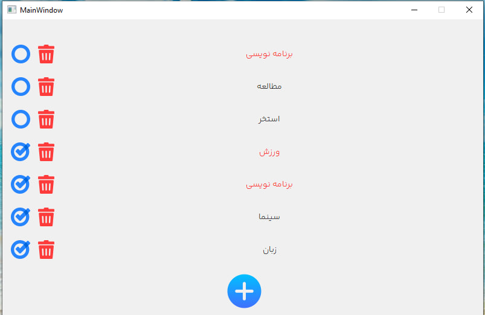
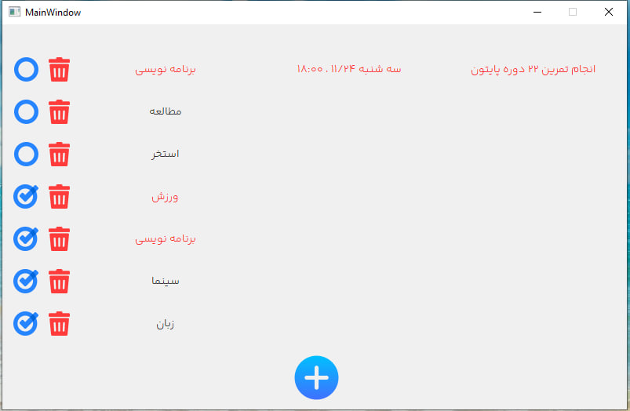
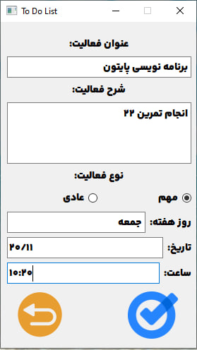

# Assignment-22
---
## To Do List
> [!NOTE]
This is a application like microsoft todo or Google task that people write works list and sign important or normal job

> [!IMPORTANT]  
## How to use:
this program was exported by pyinstaller and easy to use by executing EXE file

